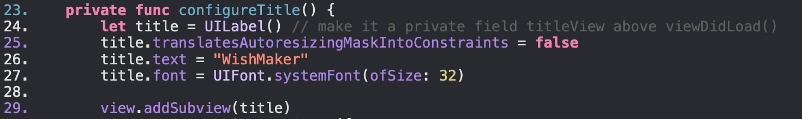

# IOSColorPalette

What issues prevent us from using storyboards in real projects?

1. It can be time consuming
2. Can be restrictive
3. It doesn't always look good
4. if we have a lot of Controllers we can accidentally change something in one of them and miss it

What does the code on lines 25 and 29 do?

on 25 line we turn off auto resizing
on 29 line add on our view our title

What is a safe area layout guide?

Safe area layout guide gives an area of the view that will remain unobscured and you can align views with it for maximum visibility.

What is [weak self] and why it is important?

We create a weak reference to the view controller in the closure by using [weak self]. This means that if the view controller is deallocated, the closure will automatically have a nil reference to 'self', preventing the retain cycle.

What does clipsToBounds mean?

A Boolean value that indicates whether the view, and its subviews, confine their drawing areas to the bounds of the view.
